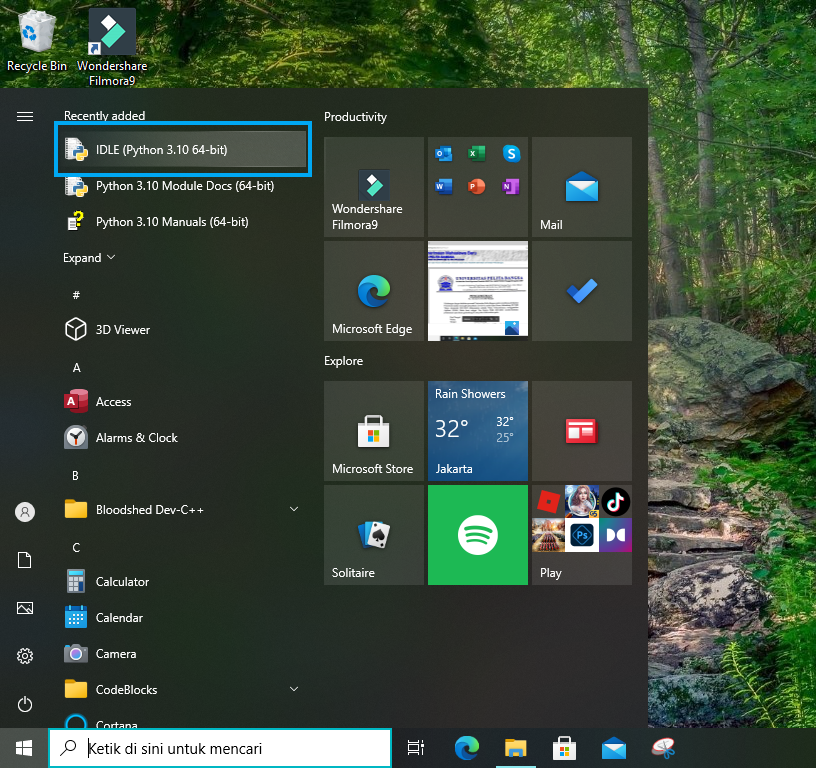
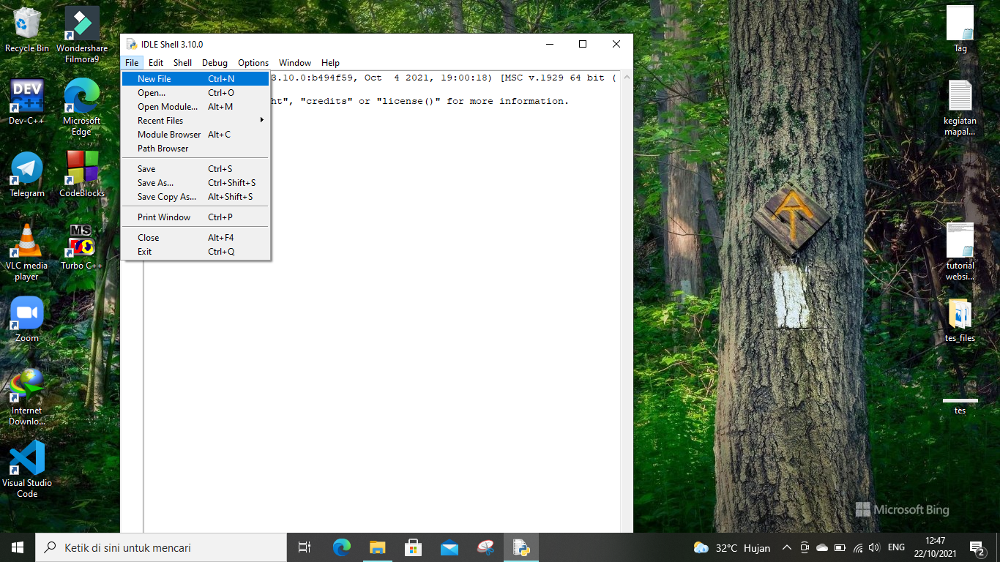

# Latihan 2
## Cara Membuat Program Biodata Dengan Python
### Bahan yang di butuhkan
- [Python](https://www.python.org)

### Membuat Program dengan Python

Pertama buka "IDLE Python"

Setelah terbuka klik, File, New file

