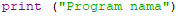

# Latihan 2
## Cara Membuat Program Biodata Dengan Python
### Bahan yang di butuhkan
- [Python](https://www.python.org)

### Membuat Program dengan Python

- Pertama buka <b>"IDLE Python"</b>

- Setelah terbuka klik, File, New file

- Setelah itu masukkan codingan seperti Gambar di bawah, lalu jangan lupa di save bila sudah selesai dengan "CTRL+S" lalu klik Run atau F5 untuk menjalankan program

- Setelah di Run program akan terlihat seperti ini

### Penjelasan Bahasa Program

-  Fungsi print() digunakan untuk mencetak atau menampilkan objek ke perangkat output seperti layar atau ke file teks

-  Fungsi input() akan membaca sebaris input (biasanya dari pengguna via keyboard) sampai ditekannya tombol Enter untuk baris baru (newline)

-  Fungsi format() digunakan untuk mengatur format string yang nantinya akan dicetak atau ditampilkan ke layar

## Demikian Pembahasan ini Semoga Bermanfaat
## TerimaKasih